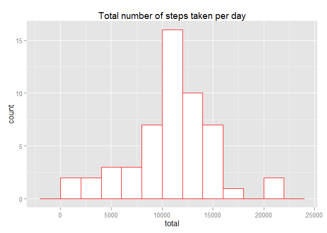
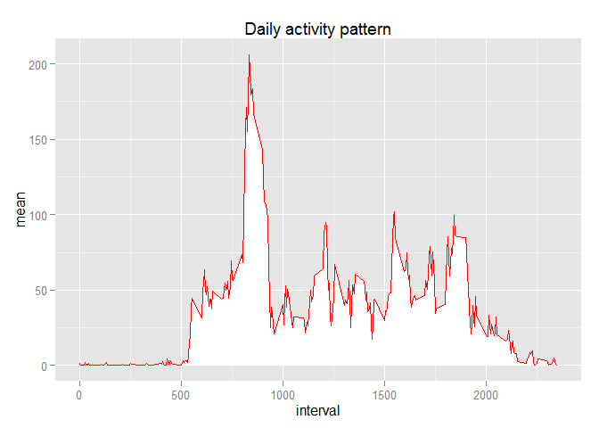
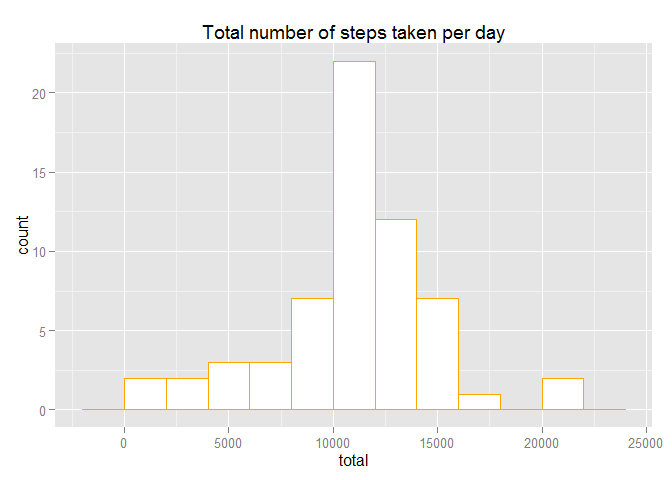
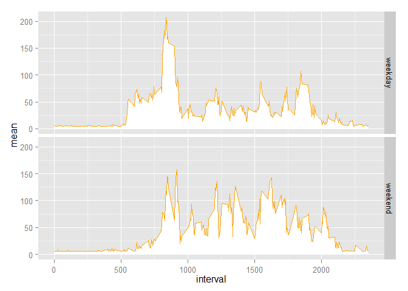

# Reproducible Research: Peer Assessment 1


## Introduction

The aim of this report, prepared as a partial evaluation exercice of the Reproducible Research course, is to answer the questions presented below. It is related to a dataset about personal movement, which has been collected by monitoring devices. The goal of data like these is to take measurements about such kind of movement in order to improve health or to find patterns of behavior.

The dataset was downloaded by the use of "fork" and "clone" commands to transfer the contents of a Github repository ("rdpeng/RepData_PeerAssessment1") to a local computer. There are a total of 17,568 observations, stored in a comma-separated-value (CSV) file.

The variables included in the dataset are:

a) steps: Number of steps taking in a 5-minute interval (missing values are coded as NA);

b) date: The date on which the measurement was taken in YYYY-MM-DD format; and

c) interval: Identifier for the 5-minute interval in which measurement was taken.

## Loading and preprocessing the data

The first step is to prepare the work enviroment and (packs "dplyr"" and "ggplot2"" needed).


```r
# Load packs dplyr and ggplot2
library(dplyr); library(ggplot2)
```

```
## Warning: package 'dplyr' was built under R version 3.1.2
```

```
## 
## Attaching package: 'dplyr'
## 
## The following object is masked from 'package:stats':
## 
##     filter
## 
## The following objects are masked from 'package:base':
## 
##     intersect, setdiff, setequal, union
```


Load the dataset from a local directory (to be choosen in the box openned).


```r
# Open a dialogue box to load "activity.csv" from a local directory
data <- read.csv(file.choose())
```

Then, check tha dataset contents.


```r
# Check the data set
glimpse(data)
```

```
## Variables:
## $ steps    (int) NA, NA, NA, NA, NA, NA, NA, NA, NA, NA, NA, NA, NA, N...
## $ date     (fctr) 2012-10-01, 2012-10-01, 2012-10-01, 2012-10-01, 2012...
## $ interval (int) 0, 5, 10, 15, 20, 25, 30, 35, 40, 45, 50, 55, 100, 10...
```


Additional preprocessing tasks are needed.


```r
# Convert variable "date" to date format
data$date <- as.Date(as.character(data$date), format="%Y-%m-%d")

# Add the column "weekend" to Identify if the date is weekend or not.
# First, it was added the column "weekday" to identify the day of the week.
# To assure reproducible results, it is necessary to avoid local time
# systems and adopt English names to the days of the week
Sys.setlocale("LC_TIME", "C")
```

```
## [1] "C"
```

```r
data <- mutate(data, weekday=weekdays(date), weekend=0)
data$weekend[data$weekday=="Saturday" | data$weekday=="Sunday"] <- 1
```


The next step is the exclusion of NA's cases and, in sequence, check the result.


```r
# Data set without NA's
data.no.na <- na.omit(data)
glimpse(data.no.na)
```

```
## Variables:
## $ steps    (int) 0, 0, 0, 0, 0, 0, 0, 0, 0, 0, 0, 0, 0, 0, 0, 0, 0, 0,...
## $ date     (date) 2012-10-02, 2012-10-02, 2012-10-02, 2012-10-02, 2012...
## $ interval (int) 0, 5, 10, 15, 20, 25, 30, 35, 40, 45, 50, 55, 100, 10...
## $ weekday  (chr) "Tuesday", "Tuesday", "Tuesday", "Tuesday", "Tuesday"...
## $ weekend  (dbl) 0, 0, 0, 0, 0, 0, 0, 0, 0, 0, 0, 0, 0, 0, 0, 0, 0, 0,...
```


## What is mean total number of steps taken per day?

The mean total number of steps taken per day is 10766 (NA's values excluded). The median is 10765.


```r
# Dataset to calculate the mean and median total number of steps taken per day
data.by.date.1 <- group_by(data.no.na, date)
data.summa.1 <- summarise(data.by.date.1, total=sum(steps),
   mean=mean(steps), median=median(steps))
glimpse(data.summa.1)
```

```
## Variables:
## $ date   (date) 2012-10-02, 2012-10-03, 2012-10-04, 2012-10-05, 2012-1...
## $ total  (int) 126, 11352, 12116, 13294, 15420, 11015, 12811, 9900, 10...
## $ mean   (dbl) 0.4375, 39.4167, 42.0694, 46.1597, 53.5417, 38.2465, 44...
## $ median (dbl) 0, 0, 0, 0, 0, 0, 0, 0, 0, 0, 0, 0, 0, 0, 0, 0, 0, 0, 0...
```

```r
# Mean and median total number of steps taken per day
summarise(data.summa.1, mean=mean(total), median=median(total))
```

```
## Source: local data frame [1 x 2]
## 
##    mean median
## 1 10766  10765
```

The histogram showing the total steps taken per day, ignoring the missing values in the dataset, is bellow.


```r
# Histogram of total steps per day
ggplot(data.summa.1, aes(total)) +
  geom_histogram(colour = "red", fill = "white", binwidth = 2000) +
  ggtitle("Total number of steps taken per day")
```

 


## What is the average daily activity pattern?

The first step to answer this question is to build a dataset grouped by intervals.


```r
# Mean of steps taken by interval
data.by.interval <- group_by(data.no.na, interval)
data.summa.2 <- summarise(data.by.interval, mean=mean(steps))
glimpse(data.summa.2)
```

```
## Variables:
## $ interval (int) 0, 5, 10, 15, 20, 25, 30, 35, 40, 45, 50, 55, 100, 10...
## $ mean     (dbl) 1.71698, 0.33962, 0.13208, 0.15094, 0.07547, 2.09434,...
```


The time series plot of the 5-minute interval (x-axis) and the average number of steps taken, averaged across all days (y-axis) is this.


```r
ggplot(data.summa.2, aes(interval, mean)) + geom_area(fill="white") +
  geom_line(color="red") + ggtitle("Daily activity pattern")
```

 

The 5-minute interval, on average across all the days in the dataset, that contains the maximum number of steps, is the 835 interval (mean = 206.2).


```r
filter(data.summa.2, mean==max(mean))
```

```
## Source: local data frame [1 x 2]
## 
##   interval  mean
## 1      835 206.2
```


## Imputing missing values

The original dataset contains 2304 cases/days (rows) with NA's values.


```r
sum(is.na(data$steps))
```

```
## [1] 2304
```

The presence of missing days may introduce bias into some calculations or summaries of the data. In some situations, it is desirable to  filling in all of the missing values in the dataset. In this report, the strategy for filling in all of the 2304 missing values in the original dataset is this: the mean of weekdays or weekends, according to the type of day of each null value.

First, calculate the mean of weekdays and weekends.


```r
data.no.na.period <- group_by(data.no.na, weekend)
summarise(data.no.na.period, mean_period=mean(steps))
```

```
## Source: local data frame [2 x 2]
## 
##   weekend mean_period
## 1       0       35.34
## 2       1       43.08
```

Second, fill in the weekdays and weekends NA's values which its means and check the result.


```r
data.2 <- data
data.2[is.na(data$steps) & data$weekend==0, ]$steps <- 35.33796
data.2[is.na(data$steps) & data$weekend==1, ]$steps <- 43.07837
glimpse(data.2)
```

```
## Variables:
## $ steps    (dbl) 35.34, 35.34, 35.34, 35.34, 35.34, 35.34, 35.34, 35.3...
## $ date     (date) 2012-10-01, 2012-10-01, 2012-10-01, 2012-10-01, 2012...
## $ interval (int) 0, 5, 10, 15, 20, 25, 30, 35, 40, 45, 50, 55, 100, 10...
## $ weekday  (chr) "Monday", "Monday", "Monday", "Monday", "Monday", "Mo...
## $ weekend  (dbl) 0, 0, 0, 0, 0, 0, 0, 0, 0, 0, 0, 0, 0, 0, 0, 0, 0, 0,...
```


The data containing the mean and median number of steps taken per day, original data with NA's values filled in, are these.


```r
data.by.date.2 <- group_by(data.2, date)
data.summa.3 <- summarise(data.by.date.2, total=sum(steps),
  mean=mean(steps), median=median(steps))
data.summa.3 <- mutate(data.summa.3, weekday=weekdays(date), weekend=0)
data.summa.3$weekend[data.summa.3$weekday=="Saturday" | data.summa.3$weekday=="Sunday"] <- 1
head(data.summa.3)
```

```
## Source: local data frame [6 x 6]
## 
##         date total    mean median   weekday weekend
## 1 2012-10-01 10177 35.3380  35.34    Monday       0
## 2 2012-10-02   126  0.4375   0.00   Tuesday       0
## 3 2012-10-03 11352 39.4167   0.00 Wednesday       0
## 4 2012-10-04 12116 42.0694   0.00  Thursday       0
## 5 2012-10-05 13294 46.1597   0.00    Friday       0
## 6 2012-10-06 15420 53.5417   0.00  Saturday       1
```


The mean and median total number of steps taken per day, original data with NA's values filled in, are: 10762 and 10571. Considering that the mean and median of the original data without NA's are 10766 and 10765, the strategy used to fill in the NA's values causes a minimun impact on the mean (-0.04%) and some impact on the median (-1.8%), but still small. 


```r
summarise(data.summa.3, mean=mean(total), median=median(total))
```

```
## Source: local data frame [1 x 2]
## 
##    mean median
## 1 10762  10571
```


The histogram of mean of steps per day, original data with NA's values filled in is presented bellow. The result is very close to the histogram with NA's ommited.


```r
ggplot(data.summa.3, aes(total)) +
  geom_histogram(colour = "orange", fill = "white", binwidth = 2000) +
  ggtitle("Total number of steps taken per day")
```

 


## Are there differences in activity patterns between weekdays and weekends?

The first step is to build a dataset the can be split in two subsets ("weekdays" and "weekends"), to plot one graph to weekdays and other to weekends.


```r
# Convert the column "weekend" to string, in order to build two separate time series plots
data.2$weekend <- ifelse(data$weekend==1, "weekend", "weekday")

data.by.interval.2 <- group_by(data.2, weekend, interval)
data.summa.4 <- summarise(data.by.interval.2, mean=mean(steps))
glimpse(data.summa.4)
```

```
## Variables:
## $ weekend  (chr) "weekday", "weekday", "weekday", "weekday", "weekday"...
## $ interval (int) 0, 5, 10, 15, 20, 25, 30, 35, 40, 45, 50, 55, 100, 10...
## $ mean     (dbl) 6.734, 5.112, 4.867, 4.890, 4.801, 6.023, 5.334, 5.73...
```


The time series plot of the 5-minute interval (x-axis) and the average number of steps taken, averaged across all days (y-axis) is presented bellow.


```r
ggplot(data.summa.4, aes(interval, mean)) + geom_area(fill="white") +
  geom_line(color="orange") + facet_grid(weekend ~ .)
```

 


There are some differences between the two graphs. The distribution is more unequal during the weekdays than in weekends. In weekdays, there is one very high peak, while in weekends some small peaks. Another difference is that, in weekdays, the distribution begins to growth suddenly and earlier than the weekends distribution, probably because of the need to go to work. In weekends, people usually wake up later and. then, the distribution growth is slower. Another difference is that there are more steps during weekends than weekdays, what may be related to physical or leisure activities.
